# Visual Studio Project Setup for SHIFT-JIS

注意事項

1. 新しいプロジェクト → デスクトップウィザード
2. デスクトップアプリケーション
    1. 追加オプション：空のプロジェクト
3. プロジェクトプロティ
    1. 構成：すべての構成
        1. 警告レベル４
        2. 詳細 > 文字セット > マルチバイト文字セットを使用する
    2. 構成：Release
        1. C/C++ > コード生成 ランタイムライブラリ > MTd
    3. 構成：Debug
        1. C/C++ > コード生成 ランタイムライブラリ > MT
4. デバッガー出力（最初一回だけ）
    1. 出力するもの
        1. 例外メッセージ
        2. メッセージのフィルター処理のステップ実行
        3. プログラム出力
5. HLSL
    1. ファイルフィルター
    2. プロパティウインドウ
        1. hlsl

---

## 手順：プロジェクト設定

### 新しいプロジェクト作成

1. 新しいプロジェクトを作成して、「Windows デスクトップ ウィザード」を選ぶ

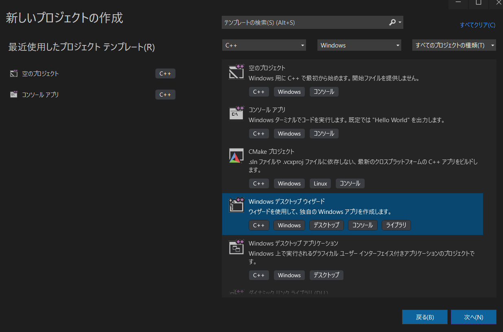

1. デスクトップアプリケーション
    1. 追加オプション：空のプロジェクト

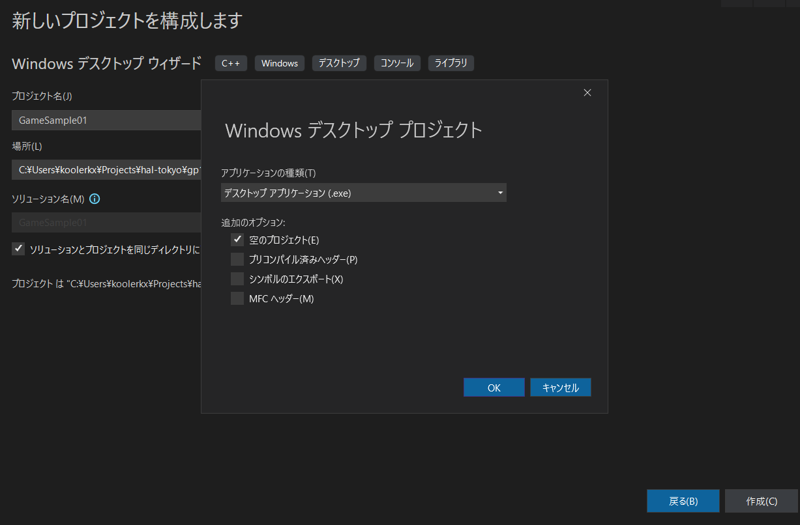

### プロジェクト設定

1. プロジェクトプロティ
    
    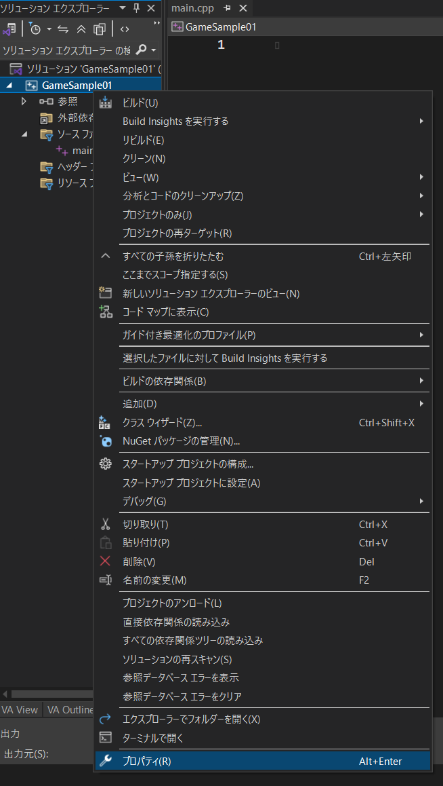
    
    1. 構成：すべての構成
        1. 警告レベル４
            
            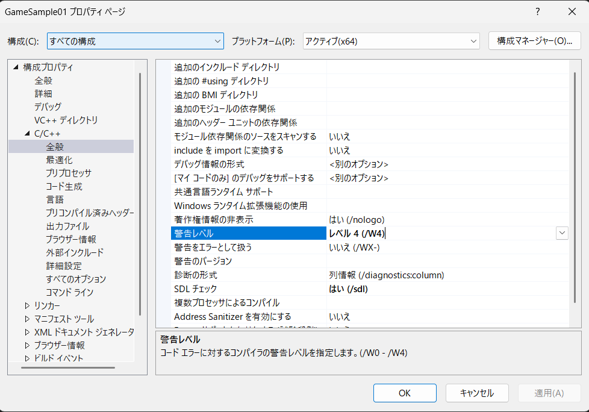
            
        2. 詳細 > 文字セット > マルチバイト文字セットを使用する
            
            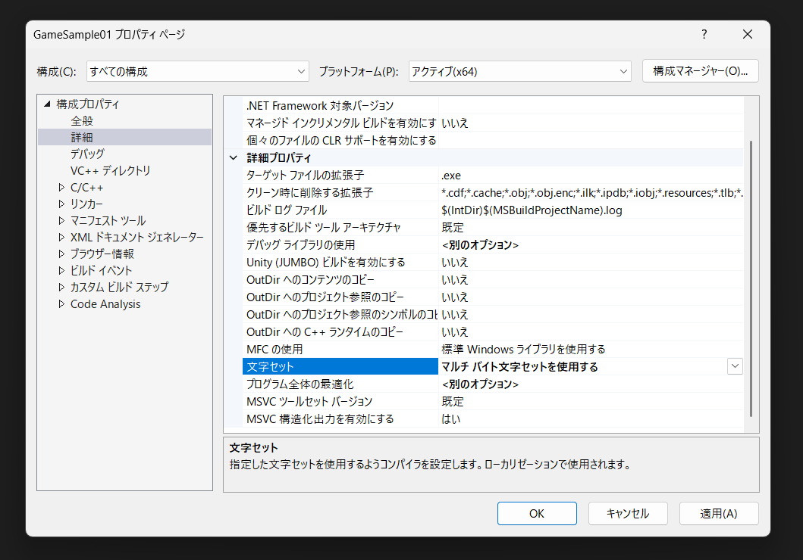
            
    2. 構成：Release
        1. C/C++ > コード生成 ランタイムライブラリ > MTd
            
            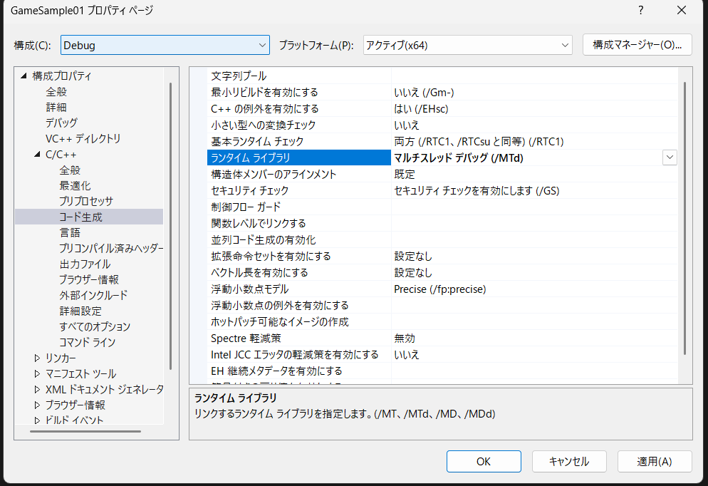
            
    3. 構成：Debug
        1. C/C++ > コード生成 ランタイムライブラリ > MT
            
            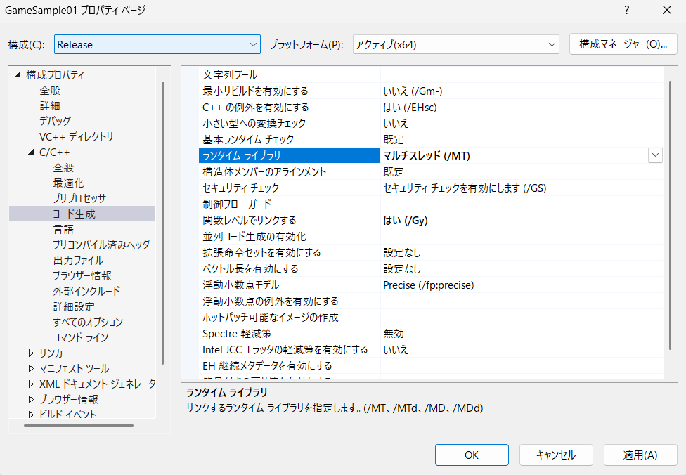
            
2. デバッガー出力（最初一回だけ）
    
    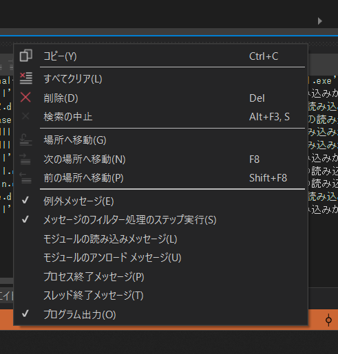
    

## HLSL追加

1. HLSL
    1. ファイルフィルター
        
        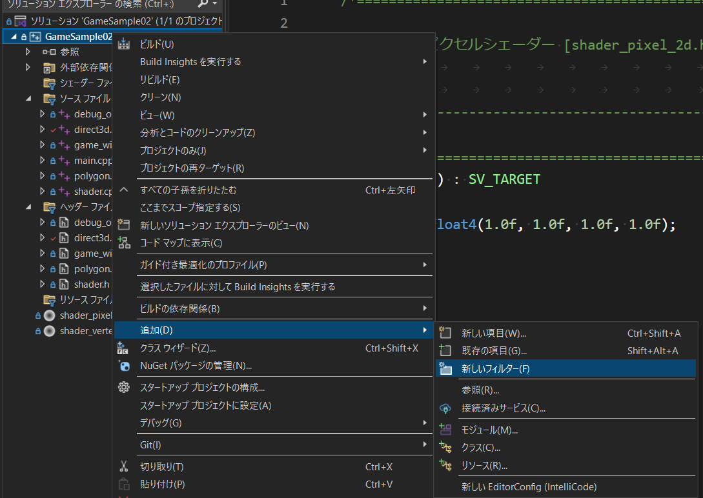
        
    2. プロパティウインドウ
        1. hlsl
        
        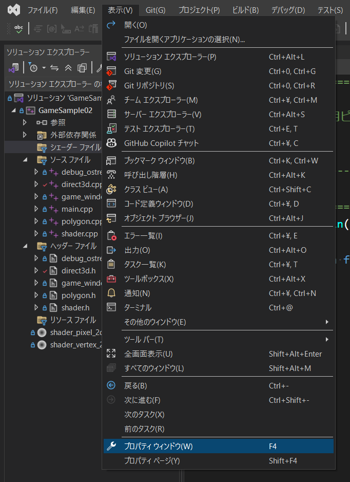
        
2. HLSL ファイルを適切な種類を選ぶ
    
    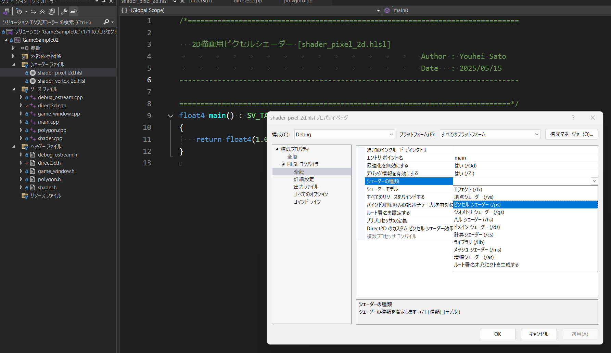